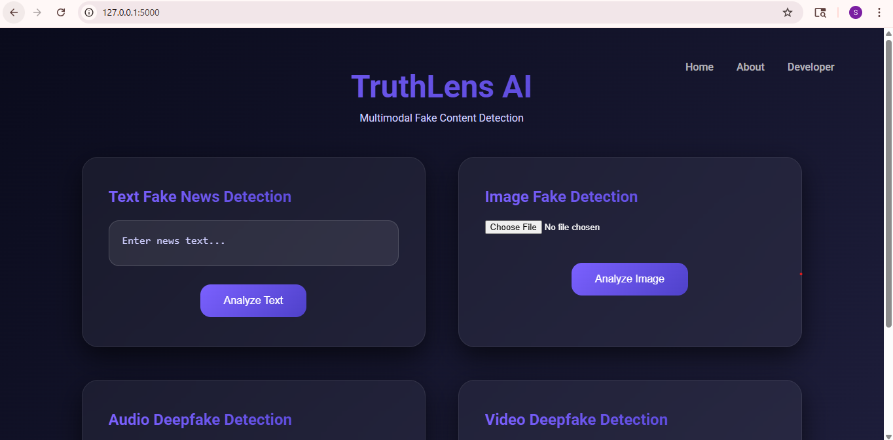

# TruthLens AI

TruthLens AI is a **Multimodal Fake Content Detection System** designed to identify whether digital content is **Real or Fake** using Machine Learning and Deep Learning techniques.

The system analyzes **Text, Images, Audio, and Video** to detect misinformation and manipulated media.  
This project integrates **Artificial Intelligence models with a web-based application** to help users verify the authenticity of digital content.

---

## Application Screenshot



---

## Features

### Text Fake News Detection
Analyzes news articles or text content and predicts whether the news is **Real or Fake** using Natural Language Processing (NLP) and machine learning models.

### Image Manipulation Detection
Uses a **Convolutional Neural Network (CNN)** model to detect manipulated or AI-generated images.

### Audio Authenticity Detection
Extracts **MFCC (Mel Frequency Cepstral Coefficients)** audio features and classifies whether the audio is **Real or Fake**.

### Video Deepfake Detection
Processes video frames and uses deep learning techniques to detect **Deepfake videos**.

---

## Technology Stack

### Frontend
- HTML
- CSS
- JavaScript

### Backend
- Python
- Flask

### Machine Learning / Deep Learning
- TensorFlow
- Keras
- Scikit-learn
- Joblib

### Audio Processing
- Librosa

### Image & Video Processing
- OpenCV
- NumPy

---

## Project Structure

```
TruthLens-AI
│
├── app.py
├── requirements.txt
├── README.md
│
├── assets
│   └── homepage.png
│
├── templates
│   ├── index.html
│   └── about.html
│
├── static
│   └── css
│       └── style.css
│
├── models
│   ├── text_model.pkl
│   ├── vectorizer.pkl
│   ├── image_model.h5
│   └── audio_model.h5
│
├── training
│   ├── train_text.py
│   ├── train_image.py
│   ├── train_audio.py
│   └── train_video.py
│
└── uploads
```

---

## Important Note

Due to **GitHub file size limitations**, the trained **video deepfake detection model (`video_model.h5`) is not included in this repository**.

The application is designed to **safely handle the absence of the video model** and will disable video detection automatically if the model file is not available.

To enable video detection:

1. Train the video model using:

```
python train_video.py
```

2. After training, place the model file inside:

```
models/video_model.h5
```

---

## Installation

Clone the repository:

```
git clone https://github.com/your-username/TruthLens-AI.git
```

Navigate to the project directory:

```
cd TruthLens-AI
```

Install the required dependencies:

```
pip install -r requirements.txt
```

---

## Running the Application

Start the Flask server:

```
python app.py
```

Open your browser and visit:

```
http://127.0.0.1:5000
```

---

## Usage

1. Open the web application.
2. Choose the detection type:
   - Text Detection
   - Image Detection
   - Audio Detection
   - Video Detection
3. Upload content or enter text.
4. The system analyzes the input and predicts whether it is **Real or Fake**.

---

## Future Improvements

- Improve deepfake video detection accuracy
- Add real-time fake content monitoring
- Deploy the application on cloud platforms
- Expand datasets to improve model performance

---

## Author

Sabarieswari S  
Artificial Intelligence & Machine Learning Enthusiast

---

## License

This project is developed for **educational and research purposes**.